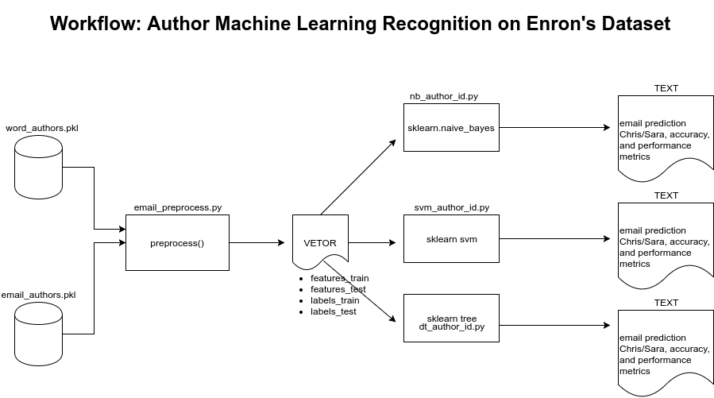

# Fraud detection machine learning on Enron enteprise dataset

### Table of Contents

   1. Abstract
   2. Environment
   3. Workflow
   4. Files
   5. Methods
       1. Naive Bayes
       2. SVM 
       3. Decision Tree
   6. Summury of Result
   7. References

## 1. Abstract

The purpose of this project is to study how well Naive Bayes, SVM, and Decision Tree machine learning algorithms can indentify emails by their authors. There will be comparinsons among them as to their respective performance and accuracy based on a pre-made list of email texts and the corresponding authors based on Enron dataset comprised of 146 users with 21 features each.

The Enron scandal, publicized in October 2001, eventually led to the bankruptcy of the Enron Corporation, an American energy company based in Houston, Texas, and the de facto dissolution of Arthur Andersen, which was one of the five largest audit and accountancy partnerships in the world. In addition to being the largest bankruptcy reorganization in American history at that time, Enron was cited as the biggest audit failure.

## 2. Environment

* Python 2.7.13 :: Anaconda 4.3.1 (64-bit)
* numpy                     1.11.3                   py27_0
* pandas                    0.19.2              np111py27_1
* scikit-learn              0.18.1              np111py27_1 

## 3. Workflow

## 4. Files

The data files, are stored in email_authors.pkl and word_data which has been developed by Katie Malone for Udacity machine learning training course.

## 5. Methods

It will be performed arguments confirguration according to each classifier below so as to reach best time performance and accurance, as well as comparisons of results.

We have a set of emails, half of which were written by one person and the other half by another person at the same company . Our objective is to classify the emails as written by one person or the other based only on the text of the email. 

###   5.1. Naive Bayes
   * make tests with percentile parameter
###   5.2. SVM
   * deploy an rbf kernel
   * optimize C parameter    
###   5.3. Decision Tree
   * make tests with percentile parameter

### 7. Summury of Result
We will reach to a conclusion based on pros and cons as to which classifier best suits to this scenario. Thus, we will have the oportunity explore these methods.

### 8. References
 Main: https://classroom.udacity.com/courses/ud120
