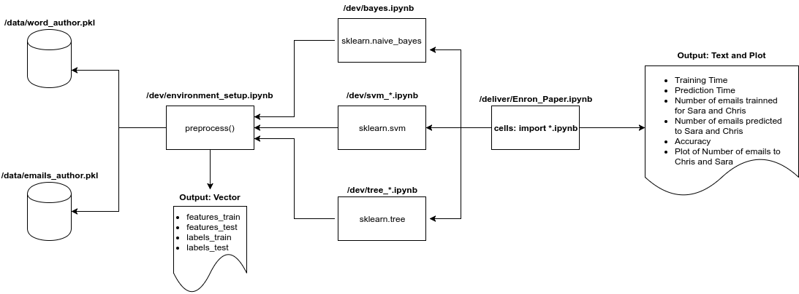

# Fraud Detection Machine Learning on Enron Enteprise Dataset

This project contains files, based on the "Udacity - Introduction to Machine Leaning course", used for the subject course "IA369Z - Computational Reproducibility Research" at Unicamp - Professor Leticia Rittner, student Eduardo Calio.

This is being used for **educational pourposes only**.

## Introduction

The purpose of this project is to provide a **reproducible paper** regarding studies on how well Naive Bayes, SVM, and Decision Tree Machine Learning Algorithms can indentify emails by their authors using a pre-processed list of email texts and the corresponding authors based on the emails and authors dataset of the famous fraud scandal of the american bankrupt Enron Corporation. We will also study ways to work with parameters to improve accuracy and performance.

## Environment
Enviroment is essencially based on the following tools:
* Anaconda2-4.4.0, that comes with: Jupyter Notebook 4.3.1, python 2.7, and scikit-learn library.
* Docker 17.03.1-ce

For more instructions on installations and detailed reproduction steps, click [here](environment/README.md) 
For suggestions on best practices, click [here](environment/BEST_PRACTICES.md)

## Structure

* /data: Holds the dataset files (email_authors.pkl and  word_data), preprocessed by Katie Malone for Udacity machine learning training course.

* /dev: In this directory it is available **.ipynb files** that are imported by the main file in deliver folder

* /deliver: Refer to the most recent **.ipynb** file in this folder as the main stable reproducible paper: 

* /figures: Contains image files imported and displayed by the main files.

## Workflow Experiments Overview: Inputs and Outputs

