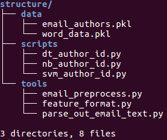

# Fraud detection machine learning on Enron enteprise dataset

## 1. Introduction

The purpose of this project is to provide a reproducible paper regarding studies on how well Naive Bayes, SVM, and Decision Tree machine learning algorithms can indentify emails by their authors using a pre-processed list of email texts and the corresponding authors based on Enron dataset, comprised of 146 users with 21 features each.

## 2. Structure and Files

The data files, are stored in email_authors.pkl and word_data which has been developed by Katie Malone for Udacity machine learning training course.

To reproduce this experiment, you will find the main file (last version of .ypnp) in the "deliver" folder . This file will contain all instructions, and it will be regarded as our reproducible paper. By papaer I mean not only the text, but data, code, and all resources required to make the experiments reproducible. 

